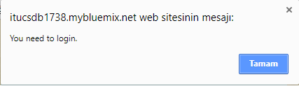
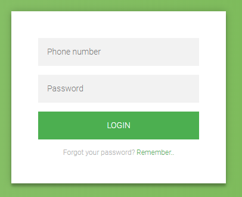
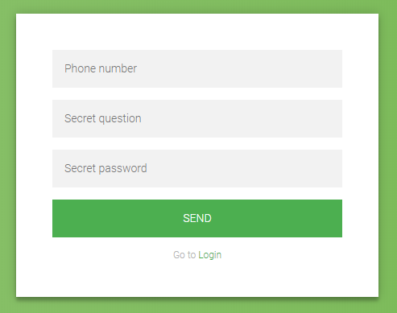
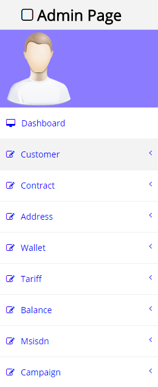
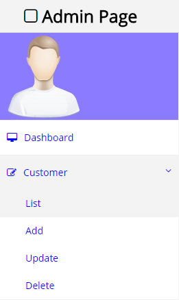
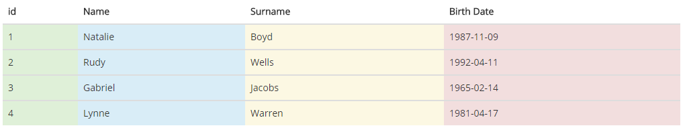
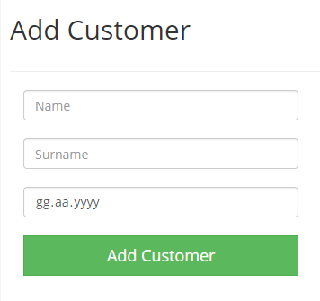
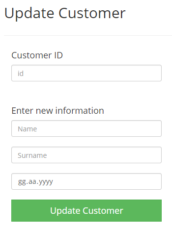
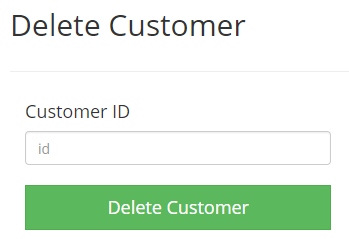

Parts Implemented by Adem Yenice
================================

All the entities implemented by Adem Yenice.
You can see all the entities from ER diagram in index page.

Homepage
--------

In this page, tariffs and campaigns are taking from database and shown to the users.
To make this operation, I first selecting tariff and campaigns tables and then send this information to the index page.
After that, whenever a get method is called by clicking the index page, these informations are shown to the user.

.. code-block:: python

   with dbapi2.connect(app.config['dsn']) as connection:
        cursor = connection.cursor()
        query = """SELECT * FROM TARIFF"""
        cursor.execute(query)
        tariffs = cursor.fetchall()

        query = """SELECT * FROM CAMPAIGN"""
        cursor.execute(query)
        campaigns = cursor.fetchall()
    return render_template('index.html', tariff_list=tariffs, campaign_list=campaigns)

As you can see, tariff and campaign informations are sent to index (home) page. To list them in the page, I used to following sytnax:

.. code-block:: html

   <table class="tm-table-full-width">
       <thead>
           <tr class="tm-bg-green-1">
               <th class="tm-plan-table-header">{{ tariff_list[0][1] }}</th>
           </tr>
       </thead>
       <tbody>
           <tr class="tm-bg-green-2"><td class="tm-plan-table-cell">{{ tariff_list[0][4] }} MB</td></tr>
           <tr class="tm-bg-green-3"><td class="tm-plan-table-cell">{{ tariff_list[0][5] }} MIN</td></tr>
           <tr class="tm-bg-green-1"><td class="tm-plan-table-cell">{{ tariff_list[0][6] }} SMS</td></tr>
           <tr class="tm-bg-green-2"><td class="tm-plan-table-cell">{{ tariff_list[0][3] }} ₺</td></tr>
           <tr class="tm-bg-green-3">
               <td class="tm-plan-table-cell tm-plan-table-cell-pad-small text-xs-center">
                   <a onclick="myFunction()" style="cursor:pointer" class="tm-bg-green-1 tm-btn-rounded tm-btn-green">Buy</a>
               </td>
           </tr>
       </tbody>
   </table>

.. code-block:: html

   <table class="tm-table-full-width tm-font-thin">
      <thead>
         <tr class="tm-bg-blue-1">
            <th class="tm-plan-table-header">{{ campaign_list[1][1] }}</th>
         </tr>
      </thead>
      <tbody>
         <tr class="tm-bg-blue-2">
            <td class="tm-plan-table-cell">{{ campaign_list[1][2] }}</td>
         </tr>
         <tr class="tm-bg-blue-3">
            <td class="tm-plan-table-cell">{{ campaign_list[1][3] }}</td>
         </tr>
         <tr class="tm-bg-blue-3">
            <td
               class="tm-plan-table-cell tm-plan-table-cell-pad-small text-xs-center">
               <a onclick="myFunction()" style="cursor:pointer" class="tm-bg-blue-1 tm-btn-rounded tm-btn-blue">Order</a>
            </td>
         </tr>
      </tbody>
   </table>

Finally, users can see CS-CELL tariffs and campaigns. If they try to click "buy" button without login, they will see the following warning message.

     Warning message when user try to buy campaign or tariff without login.

Login
-----

When user click login button in the home page, they will be directed to login page. In this page, users need to enter their phone number and password to login website.
After user enters information to textboxes and click sign in button, then this means post function is called for login page.

     Login page, user can login CS-CELL.

I first control if the entered information (phone number and password) are stored in database. If the informations are matched then I send user information to user_page.
Otherwise user will get an error message that indicates invalid phone number and password.

.. code-block:: python

    error = None
    if request.method == 'POST':
        phone_number = request.form['phone_number']
        password = request.form['password']
        exists = False
        is_admin = False

So far, I take the entered informations if user clicks the login button and trigger POST method. Then I check the given information with the following code:

.. code-block:: python

     query = """SELECT msisdn_number, password FROM MSISDN"""
     cursor.execute(query)
     users = cursor.fetchall()

     query = """SELECT * FROM CUSTOMER"""
     cursor.execute(query)
     adminInfo = cursor.fetchall()

     for row in users:
            if phone_number == row[0] and password == row[1]:
                exists = True

I checked user informations. If the given informations are not stored in database then user will see an error, otherwise user will be directed to user_page.

.. code-block:: python

      if exists == False:
          error = 'Invalid Credentials. Please try again.'
          print('Error : ', error)
      else:
          with dbapi2.connect(app.config['dsn']) as connection:
              cursor = connection.cursor()

              cursor.execute("SELECT id FROM MSISDN WHERE msisdn_number='%s'"%phone_number)
              data = cursor.fetchall()

          user_information = data[0][0]
          print('MSISDN id : ', user_information)

          return redirect(url_for('user_page', user_information=user_information))
          exists = True

Remember
--------

When users forgot their password, then they can learn it from remember page. To reach this page, user need to click remember button in the login page.

     Users can learn their password from this page.

Users need to enter their phone number, secret question and secret password correctly. Then I take this informations and searched them in database.
If the informations are true, then I will show the password to user. Otherwise, they will get an error message.

.. code-block:: python

    error = None
    user_password = None
    if request.method == 'POST':
        phone_number = request.form['phone_number']
        secret_question = request.form['secret_question']
        secret_answer = request.form['secret_answer']

So far, I take the entered information from user. The following code is checking the information in database. If the informations are true, then I show the password
to the user, otherwise user will see an error message.

.. code-block:: python

        if (phone_number == '') | (secret_question == '') | (secret_answer == ''):
               error = 'Please fill blank areas.'
        else:
            with dbapi2.connect(app.config['dsn']) as connection:
                cursor = connection.cursor()
                cursor.execute("SELECT secret_question, secret_answer FROM CONTRACT WHERE id = (SELECT contract_id FROM MSISDN WHERE msisdn_number='%s')"%phone_number)
                data = cursor.fetchall()

                matched = False
                for row in data:
                    if secret_question == row[0] and secret_answer == row[1]:
                        matched = True

                if matched == False:
                    error = 'Invalid information. Please try again.'
                else:
                    with dbapi2.connect(app.config['dsn']) as connection:
                        cursor = connection.cursor()
                        cursor.execute("SELECT password FROM MSISDN WHERE msisdn_number='%s'"%phone_number)
                        password = cursor.fetchall()

                    error = None
                    user_password = password[0][0]
    return render_template('remember.html', error=error, user_password=user_password)

To show the error or user password to user, I used following html code:

.. code-block:: html

     
       
<strong>Error:</strong> {{ error }}
     
     
       
<strong>Your password : </strong> {{ user_password }}
     

As a result, the purpose of this page is to show their password to users when they forgot it.
To do that, they need to enter secret question and secret password correctly.

initdb
------

This page delete all tables and create them again. Then add some data to tables.
There nine different tables and all tables have some data.
You can check the following sql code:

.. code-block:: sql

        # First I delete all the tables.
        query = """DROP TABLE IF EXISTS TARIFF, CUSTOMER, CONTRACT, ADDRESS, CAMPAIGN, CAMPAIGN_MSISDN, BALANCE, MSISDN, WALLET, COUNTER"""
        cursor.execute(query)

        ### Now, I will add all the tables.
        query = """CREATE TABLE TARIFF (
                                         id SERIAL,
                                         name VARCHAR(50) NOT NULL,
                                         description VARCHAR(255) NOT NULL,
                                         price INTEGER NOT NULL,
                                         data INTEGER NOT NULL,
                                         voice INTEGER NOT NULL,
                                         sms INTEGER NOT NULL,
                                         CHECK((price >= 0) AND (data >= 0) AND (voice >= 0) AND (sms >= 0)),
                                         PRIMARY KEY (id)
                                        )"""
        cursor.execute(query)

        query = """CREATE TABLE CUSTOMER (
                                           id SERIAL,
                                           name VARCHAR(50) NOT NULL,
                                           surname VARCHAR(50) NOT NULL,
                                           birth_date DATE NOT NULL,
                                           PRIMARY KEY (id)
                                          )"""
        cursor.execute(query)

        query = """CREATE TABLE CONTRACT (
                                           id SERIAL,
                                           secret_question VARCHAR(255) NOT NULL,
                                           secret_answer VARCHAR(255) NOT NULL,
                                           customer_id INTEGER NOT NULL,
                                           PRIMARY KEY (id),
                                           FOREIGN KEY (customer_id) REFERENCES CUSTOMER(id) ON DELETE CASCADE ON UPDATE CASCADE
                                          )"""
        cursor.execute(query)

        query = """CREATE TABLE ADDRESS (
                                           id SERIAL,
                                           name VARCHAR(50) NOT NULL,
                                           description VARCHAR(255) NOT NULL,
                                           contract_id INTEGER NOT NULL,
                                           PRIMARY KEY (id),
                                           FOREIGN KEY (contract_id) REFERENCES CONTRACT(id) ON DELETE CASCADE ON UPDATE CASCADE
                                          )"""
        cursor.execute(query)

        query = """CREATE TABLE CAMPAIGN (
                                           id SERIAL,
                                           name VARCHAR(50) NOT NULL,
                                           description VARCHAR(255) NOT NULL,
                                           rule VARCHAR(255) NOT NULL,
                                           PRIMARY KEY (id)
                                          )"""
        cursor.execute(query)

        query = """CREATE TABLE BALANCE (
                                           id SERIAL,
                                           remaining_data INTEGER NOT NULL,
                                           remaining_voice INTEGER NOT NULL,
                                           remaining_sms INTEGER NOT NULL,
                                           msisdn_id INTEGER NOT NULL,
                                           contract_id INTEGER NOT NULL,
                                           CHECK((remaining_data >= 0) AND (remaining_voice >= 0) AND (remaining_sms >= 0)),
                                           PRIMARY KEY (id),
                                           FOREIGN KEY (contract_id) REFERENCES CONTRACT(id) ON DELETE CASCADE ON UPDATE CASCADE
                                          )"""
        cursor.execute(query)

        query = """CREATE TABLE MSISDN (
                                          id SERIAL,
                                          msisdn_number VARCHAR(11) NOT NULL,
                                          password VARCHAR(22) NOT NULL,
                                          activation_date DATE NOT NULL DEFAULT CURRENT_DATE,
                                          contract_id INTEGER NOT NULL,
                                          balance_id INTEGER NOT NULL,
                                          tariff_id INTEGER NOT NULL,
                                          PRIMARY KEY (id),
                                          FOREIGN KEY (contract_id) REFERENCES CONTRACT(id) ON DELETE CASCADE ON UPDATE CASCADE,
                                          FOREIGN KEY (balance_id) REFERENCES BALANCE(id) ON DELETE CASCADE ON UPDATE CASCADE,
                                          FOREIGN KEY (tariff_id) REFERENCES TARIFF(id) ON DELETE CASCADE ON UPDATE CASCADE
                                         )"""
        cursor.execute(query)

        query = """CREATE TABLE CAMPAIGN_MSISDN (
                                                 msisdn_id INTEGER NOT NULL,
                                                 campaign_id INTEGER NOT NULL,
                                                 FOREIGN KEY (msisdn_id) REFERENCES MSISDN(id) ON DELETE CASCADE ON UPDATE CASCADE,
                                                 FOREIGN KEY (campaign_id) REFERENCES CAMPAIGN(id) ON DELETE CASCADE ON UPDATE CASCADE
                                                 )"""
        cursor.execute(query)

        query = """CREATE TABLE WALLET (
                                         id SERIAL,
                                         amount INTEGER NOT NULL,
                                         customer_id INTEGER NOT NULL,
                                         PRIMARY KEY (id),
                                         FOREIGN KEY (customer_id) REFERENCES CUSTOMER(id) ON DELETE CASCADE ON UPDATE CASCADE
                                        )"""
        cursor.execute(query)

        ### I insert some data to the TARIFF table.
        query = """INSERT INTO TARIFF(name, description, price, data, voice, sms)
                               VALUES('STUDENT PACK', 'Genclere ozel tarife. Her yone 500 dk konusma, 1000 sms ustelik 2 gb internet aylik sadece 20 TL', 20, 2048, 500, 1000);

                   INSERT INTO TARIFF(name, description, price, data, voice, sms)
                                VALUES('BUSINESS PACK', 'Bana hicbir sey yetmiyor diyenlere ozel tarife. Her yone 2000 dk konusma, 5000 sms ve 16 gb internet aylik 50 TL', 50, 16384, 2000, 5000);

                   INSERT INTO TARIFF(name, description, price, data, voice, sms)
                                VALUES('ECONOMY PACK', 'Herkes kesime hitap eden hesapli tarife. Her yone 250 dk konusma, 500 sms ve 1 gb internet sadece aylik 15 TL', 15, 1024, 250, 500);

                   INSERT INTO TARIFF(name, description, price, data, voice, sms)
                                VALUES('USER PACK', 'Ben sadece konusma paketi istiyorum diyorsaniz bu tarife tam size gore. Her yone 2500 dk konusma ve 1 gb internet aylik 20 TL', 20, 1024, 2500, 0)"""
        cursor.execute(query)

        ### I insert some data to the CUSTOMER table.
        query = """ INSERT INTO CUSTOMER(name, surname, birth_date)
                                VALUES('Natalie', 'Boyd', '1987-11-09');

                    INSERT INTO CUSTOMER(name, surname, birth_date)
                        VALUES('Rudy', 'Wells', '1992-04-11');

                    INSERT INTO CUSTOMER(name, surname, birth_date)
                        VALUES('Gabriel', 'Jacobs', '1965-02-14');

                    INSERT INTO CUSTOMER(name, surname, birth_date)
                        VALUES('Lynne', 'Warren', '1981-04-17');

                    INSERT INTO CUSTOMER(name, surname, birth_date)
                        VALUES('Admin', '123456', '1991-06-09')"""
        cursor.execute(query)

        ### I insert some data to the CONTRACT table.
        query = """ INSERT INTO CONTRACT(secret_question, secret_answer, customer_id)
                        VALUES('First school?', 'I dont remember', 1);

                    INSERT INTO CONTRACT(secret_question, secret_answer, customer_id)
                        VALUES('Favorite fruite?', 'Banana', 2);

                    INSERT INTO CONTRACT(secret_question, secret_answer, customer_id)
                        VALUES('Favorite Band?', 'The Beatles', 3);

                    INSERT INTO CONTRACT(secret_question, secret_answer, customer_id)
                        VALUES('What is your first teacher name?', 'Barny', 4)"""
        cursor.execute(query)

        ### I insert some data to the CAMPAIGN table.
        query = """ INSERT INTO CAMPAIGN(name, description, rule)
                    VALUES('FOR NEWS PACK', 'This campaign for the new customers. 1000 MIN, 2000 SMS and 4 GB internet.', 'To use this campaign, you should be new customer.');

                    INSERT INTO CAMPAIGN(name, description, rule)
                    VALUES('ADVANTAGE PACK', 'This campaign for the customers who transfer CS-CELL from another one. 2000 MIN, 5000 SMS, 6 GB internet.', 'To use this campaign, you should be transferred to CS-CELL from another company.');

                    INSERT INTO CAMPAIGN(name, description, rule)
                    VALUES('COUPLE PACK', 'This campaign for the customers who are married. 750 MIN, 1500 SMS, 6 GB internet.', 'To use this campaign, you should be married.')"""
        cursor.execute(query)

        ### I insert some data to the ADDRESS table.
        query = """ INSERT INTO ADDRESS(name, description, contract_id)
                        VALUES('Ev', 'Beylikduzu - Istanbul', 1);

                    INSERT INTO ADDRESS(name, description, contract_id)
                        VALUES('Is', 'Maslak - Istanbul', 1);

                    INSERT INTO ADDRESS(name, description, contract_id)
                        VALUES('Is', 'Etimesgut - Ankara', 2);

                    INSERT INTO ADDRESS(name, description, contract_id)
                        VALUES('Ev', 'Harran - Sanliurfa', 3);

                    INSERT INTO ADDRESS(name, description, contract_id)
                        VALUES('Is', 'Didim - Aydin', 3);

                    INSERT INTO ADDRESS(name, description, contract_id)
                        VALUES('Ev', 'Bahcelievler - Istanbul ', 4)"""
        cursor.execute(query)

        ### I insert some data to the WALLET table.
        query = """ INSERT INTO WALLET(amount, customer_id)
                        VALUES(50, 2);

                    INSERT INTO WALLET(amount, customer_id)
                        VALUES(75, 3);

                    INSERT INTO WALLET(amount, customer_id)
                        VALUES(100, 4);

                    INSERT INTO WALLET(amount, customer_id)
                        VALUES(60, 1)"""
        cursor.execute(query)

        ### I insert some data to the BALANCE table.
        query = """ INSERT INTO BALANCE(remaining_data, remaining_voice, remaining_sms, msisdn_id, contract_id)
                        VALUES(730, 720, 0, 0, 1);

                    INSERT INTO BALANCE(remaining_data, remaining_voice, remaining_sms, msisdn_id, contract_id)
                        VALUES(722, 21, 443, 0, 2);

                    INSERT INTO BALANCE(remaining_data, remaining_voice, remaining_sms, msisdn_id, contract_id)
                        VALUES(325, 452, 123, 0, 3);

                    INSERT INTO BALANCE(remaining_data, remaining_voice, remaining_sms, msisdn_id, contract_id)
                        VALUES(562, 142, 534, 0, 4)"""
        cursor.execute(query)

        ### I insert some data to the MSISDN table.
        query = """ INSERT INTO MSISDN(msisdn_number, password, contract_id, balance_id, tariff_id)
                        VALUES('11111111111', 'deneme', 1, 4, 1);

                    INSERT INTO MSISDN(msisdn_number, password, contract_id, balance_id, tariff_id)
                        VALUES('22222222222', 'deneme', 2, 3, 2);

                    INSERT INTO MSISDN(msisdn_number, password, contract_id, balance_id, tariff_id)
                        VALUES('33333333333', 'deneme', 3, 2, 3);

                    INSERT INTO MSISDN(msisdn_number, password, contract_id, balance_id, tariff_id)
                        VALUES('44444444444', 'deneme', 4, 1, 4)"""
        cursor.execute(query)

        ### I insert some data to the CAMPAIGN_MSISDN table.
        query = """ INSERT INTO CAMPAIGN_MSISDN(msisdn_id, campaign_id)
                        VALUES(1, 1);

                    INSERT INTO CAMPAIGN_MSISDN(msisdn_id, campaign_id)
                        VALUES(2, 2);

                    INSERT INTO CAMPAIGN_MSISDN(msisdn_id, campaign_id)
                        VALUES(3, 2);

                    INSERT INTO CAMPAIGN_MSISDN(msisdn_id, campaign_id)
                        VALUES(4, 1)"""
        cursor.execute(query)

        ### I updated some data in the BALANCE table and add a FOREIGN KEY.
        query = """ UPDATE BALANCE
                        SET msisdn_id = 1
                        WHERE id = 4;

                    UPDATE BALANCE
                        SET msisdn_id = 2
                        WHERE id = 3;

                    UPDATE BALANCE
                        SET msisdn_id = 3
                        WHERE id = 2;

                    UPDATE BALANCE
                        SET msisdn_id = 4
                        WHERE id = 1;

                    ALTER TABLE BALANCE
                        ADD CONSTRAINT fk_balance_msisdn_id
                        FOREIGN KEY (msisdn_id)
                        REFERENCES MSISDN(id)
                        ON DELETE CASCADE ON UPDATE CASCADE"""
        cursor.execute(query)

        connection.commit()
    return redirect(url_for('index_page'))

These block of code initialize the database and add some data to tables. Also there update processing at the end of the code.

Admin Page
----------

In additon to customer, there is another user type that is admin user. Admin user can see all the entities. Admin user also list, add, delete and update all the
data in the table. In order to login with admin user, I added a control mechanism in login page. If the entered phone number and password are matched with admin
information, then user will be directed to admin page.

.. code-block:: html

   if phone_number == adminInfo[4][1] and password == adminInfo[4][2]:
      is_admin = True

   if is_admin == True:
         return redirect(url_for('admin_page'))

Let's say a user connect to admin page. Then this user can list all the tables. User can add some data to tables, update them and delete them.
The admin page can be seen below:

     Admin user has right CRUD operation on all tables.

There are nine different table that admin can control. However I will explain one of them which is customer table. If admin user want to list, or any other process for customer table,
admin can use dropdown menu. You can see the following image to see it:

     Admin can list, add, delete and update data to Customer table.

Now, I will explain these four process. Every table have these CRUD operation in admin page. I only explain for customer table.

List Customer
-------------

To list the customer table, I used to following python code. Whenever an admin visit the customer list page, this query is requested.

.. code-block:: python

   with dbapi2.connect(app.config['dsn']) as connection:
        cursor = connection.cursor()
        query = """SELECT * FROM CUSTOMER"""
        cursor.execute(query)
        customers = cursor.fetchall()

    return render_template('customer_list.html', customers=customers)

I am taking all customer information from database and then send them to the related html page.
To show the informations to the admin user, I used to following html code:

.. code-block:: html

   <table class="table">
        
            <thead>
            <tr>
               <th>id</th>
               <th>Name</th>
               <th>Surname</th>
               <th>Birth Date</th>
            </tr>
         </thead>
           
         <tbody>
            <tr>
             <td class="success">{{ customer[0]}}</td>
             <td class="info">{{ customer[1]}}</td>
             <td class="warning">{{ customer[2]}}</td>
             <td class="danger">{{ customer[3]}}</td>
           </tr>
         </tbody>
      
   
   </table>

The output of this page can be seen below:

     Admin can list Customer table.

Add Customer
------------

Admin user can also add a new customer to customer table. In order to do that, admin needs to enter customer informations. If any of the textbox is empty,
then admin user will be shown an error message. Otherwise, new customer will be added to customer table and admin user will be informed.

.. code-block:: python

    info = None
    if request.method == 'POST':
        Name = request.form['name']
        Surname = request.form['surname']
        Birth_date = request.form['birth_date']

        if (Name == '') | (Surname == '') | (Birth_date == ''):
            info = 'Please fill blank areas.'
        else:
            with dbapi2.connect(app.config['dsn']) as connection:
                cursor = connection.cursor()
                cursor.execute("INSERT INTO CUSTOMER(name, surname, birth_date) VALUES ('%s', '%s', '%s')"%(Name, Surname, Birth_date))
                connection.commit()
                info = "Customer added successfully."

    return render_template('customer_add.html', info=info)

This is the python code of adding new customer. First, I took entered informations from textboxes then I controlled them if they empty or not.
After that, I added them to customer table and send the related message to customer add page. The html code of customer add page can be seen below:

.. code-block:: html

   

         

            <form class="customer-add-form" method="post">
         <input class="form-control" type="text" placeholder="Name" name="name"  value="{{ request.form.name }}"/> 
         <input class="form-control" type="text" placeholder="Surname" name="surname"  value="{{ request.form.surname }}"/> 
         <input class="form-control" type="date" name="birth_date"  value="{{ request.form.birth_date }}"/> 
         <button class="btn btn-success btn-lg btn-block">Add Customer</button> 
         
             
<strong> {{ info }} </strong>
        
      </form>
         

     

As you see at the end of the html code I'm showing the message to the admin user.
You can see the image of the page below:

     Admin can add a new customer to Customer table.

Update Customer
---------------

Admin user can update a customer. To do this, admin need to select Update Customer link. After that, update customer page will be opened. The image of this page can be seen below:

     Admin can update any customer from Customer table.

As seen from image, admin first need to enter id of the customer. I took this id and check it if this id is exist in the customer table.
If customer is found, then I took new values from textboxes that filled by admin user and update the customer informations. The python code of
update process can be seen below:

.. code-block:: python

    info = None
    if request.method == 'POST':
        ID = request.form['id']
        Name = request.form['name']
        Surname = request.form['surname']
        Birth_date = request.form['birth_date']

        if (ID == '') | (Name == '') | (Surname == '') | (Birth_date == ''):
            info = 'Please fill blank areas.'
        else:
            with dbapi2.connect(app.config['dsn']) as connection:
                cursor = connection.cursor()
                query = """SELECT id FROM CUSTOMER"""
                cursor.execute(query)
                IDs = cursor.fetchall()

                ID = int(ID)
                user_found = False

                for row in IDs:
                    if ID == row[0]:
                        user_found = True

                if user_found == True:
                    cursor.execute("UPDATE CUSTOMER SET name = '%s', surname = '%s',  birth_date = '%s' WHERE id = '%d'"%(Name, Surname, Birth_date, ID))
                    connection.commit()
                    info = "Customer updated successfully."
                else:
                    info = "Customer id cannot be found. Try again."

    return render_template('customer_update.html', info=info)

Admin user cannot do update process if any of textbox is empty. If error is occured any of process, then admin user will be informed. Otherwise, update
process will be done and admin user will be informed. Html code of this page can be seen below:

.. code-block:: html

   

         

            <form class="customer-add-form" method="post">
                 <h4>Customer ID</h4>
                 <input class="form-control" type="text" placeholder="id" name="id"  value="{{ request.form.id }}"/>  
                 <h4>Enter new information</h4>
         <input class="form-control" type="text" placeholder="Name" name="name"  value="{{ request.form.name }}"/> 
         <input class="form-control" type="text" placeholder="Surname" name="surname"  value="{{ request.form.surname }}"/> 
         <input class="form-control" type="date" name="birth_date"  value="{{ request.form.birth_date }}"/> 
         <button class="btn btn-success btn-lg btn-block">Update Customer</button> 
         
             
<strong> {{ info }} </strong>
        
      </form>
         

    

Delete Customer
---------------

Delete customer operation can be done by admin user. Admin needs to enter id that belongs to customer admin want to delete. To find id of customer,
admin can use list customer page, and then find the id of the customer. The image of this page can be seen below:

     Admin can delete any customer from Customer table.

I first took the id from textbox and then control this id. If admin user send an empty value then admin will see an error message. Otherwise, I took id and search it in customer table. The python code that belongs to this operation can be seen below:

.. code-block:: python

    info = None
    if request.method == 'POST':
        ID = request.form['id']

        if (ID == ''):
            info = 'Please enter customer id.'
        else:
            with dbapi2.connect(app.config['dsn']) as connection:
                cursor = connection.cursor()
                query = """SELECT id FROM CUSTOMER"""
                cursor.execute(query)
                IDs = cursor.fetchall()

                ID = int(ID)
                user_found = False

                for row in IDs:
                    if ID == row[0]:
                        user_found = True

                if user_found == True:
                    cursor.execute("DELETE FROM CUSTOMER WHERE id = '%d'"%ID)
                    connection.commit()
                    info = "Customer deleted successfully."
                else:
                    info = "Customer id cannot be found. Try again."

    return render_template('customer_delete.html', info=info)

The HTML code of this page can be seen below:

.. code-block:: html

   

      

         <form class="customer-add-form" method="post">
            <h4>Customer ID</h4>
            <input class="form-control" type="text" placeholder="id" name="id"  value="{{ request.form.id }}"/>  
            <h4>Enter new information</h4>
            <input class="form-control" type="text" placeholder="Name" name="name"  value="{{ request.form.name }}"/> 
            <input class="form-control" type="text" placeholder="Surname" name="surname"  value="{{ request.form.surname }}"/> 
            <input class="form-control" type="date" name="birth_date"  value="{{ request.form.birth_date }}"/> 
            <button class="btn btn-success btn-lg btn-block">Update Customer</button> 
            
                
<strong> {{ info }} </strong>
           
         </form>
      

     

Further Information
-------------------

If you have any question or any unclear part you can contact with me. Thanks for reading.