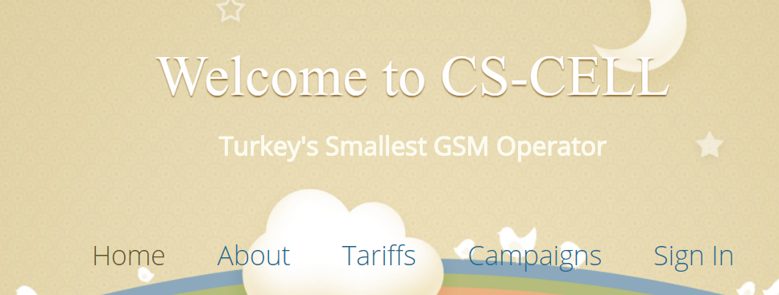
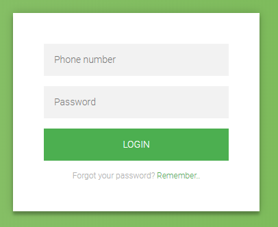
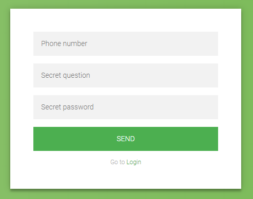
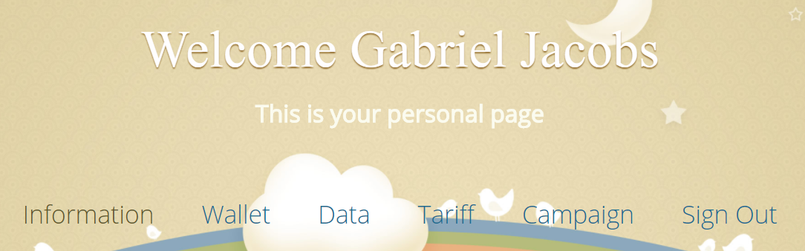

Parts Implemented by Adem Yenice
================================
All pages created by Adem Yenice.

Index
-----
This is the homepage. Whenever any user visits CS-CELL website, they will see this page. In this page, users can see different tariffs, and different campaigns.
Also, there are additional information about CS-CELL GSM operator.

     This is the homepage of CS-CELL

Login
-----
Users need to enter their phone number and password to login CS-CELL. After successfully login process, they can see their personal informations.
If the entered phone number and password are invalid, then they will be informed. If users forgot their password, then they can use remember page to find their password.

     To see their informations, users need to login with this page.

Remember
--------
This is the page that users can learn their password, if they forgot it. First, users need to enter their phone number, secret question, secret password.
If these informations are matched with database information, then the password that belongs to user will be shown to the user. Otherwise, user cannot learn the password.

After learning the password, they can go to login page and login with that password.

     Remember page where users can learn their password, if they forgot it.

User Page
---------
After successfully login operation, users will reach this page that shows user information. In this page, user can see their personal informations like address information,
wallet information. Also, they can see their tariff information, campaign information if they have. The most important thing is they can see balance information in their tariff such as
voice, sms and data information. These informations are shown with pie chart so that it will be easy to learn how many of data are used and unused.

After learning all the information, they can logout and close the website.

     Personal information, tariff, balance and campaign are shown to the user.